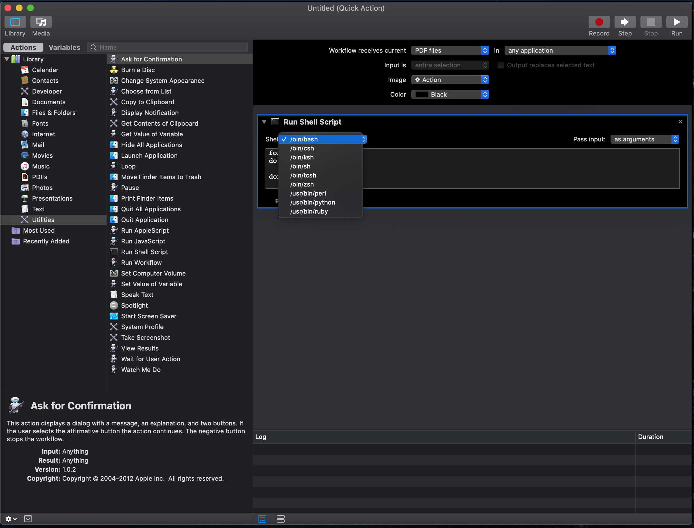

# MacOS Zebra 203dpi Barcode Fix

I recently obtained a Zebra 2844-Z thermal label printer, and realized all of my barcode on shipping labels came out fuzzy/blurry. I came to realize it only happens on MacOS and not Windows. After countless hours of searching the internet, this issue seemed fairly widespread with no apparent solution. I figured out a workaround (for now), in hopes to alleviate some of the headache that this issue may have caused.

## The Problem


The label on the right was printed utilizing the generic EPL/ZPL drivers included on MacOS. The label on the left, was printed from the same printer, on the same Mac, but using this workaround. You can notice how much more crisp the barcode looks than the one on the right.

## The Cause

Most postage solution services generate a PDF with the postage, then from there you would print to your thermal printer. When printing MacOS converts the PDF into a raster image (bitmap) > then sends it to the printer. The printer driver (rastertolabel), reads the image then tries to figure out how to translate it on paper. This may cause the image to dither.

Think of it like pouring a container with 2 gallons of water, into a 1 gallon container. what do you do with the extra water? what happens when you spill the water? etc. What you've done is create a mess. 

## The Fix

1) Convert the PDF into a image with 203 dpi (or whatever matches your printer)
2) Print the converted image

This makes it so there is minimal translation when printing. What you get is nice crisp text and barcodes.

## Workaround Solutions

BOTH solutions require you to save the PDF file to your computer first.

### Solution 1: Use Adobe Acrobat's built in function


#### Prerequiites
 - You must have Adobe Acrobat Installed


#### Instructions
1) Open the Label in Adobe Acrobat
2) Go to File > Print
3) Click on Advanced
4) Make sure "Print As Image" and the same dpi as your printer. In this case, it will be set at 203 dpi

In my use case, the dpi would have to be set on EVERY printout. This was extremely cumbersome, and a waste of time when printing many labels at once.

### Solution 2 (Preferred): Create a Mac Quick Action to do all this for you


#### Prerequities
- You will need your Device Name
- Homebrew
- Imagemagick
- Ghostscript

You may skip to the instructions if you already have this ready.

**To get your printer name**

Open up Terminal and type the following command
  
```bash
lpstat -p
```

EXAMPLE - My printer name would be *Zebra_LP2844_Z*
```bash
> lpstat -p -d
printer Dell_Printer_E310dw is idle.  enabled since Wed Jul  1 12:12:56 2020
printer Zebra_LP2844_Z is idle.  enabled since Fri Jul  3 10:20:35 2020
>
```

**Installing Imagemagick and Ghostscript**

Both of these can be installed using [Homebrew](https://brew.sh/). If you do not have Homebrew installed, please visit https://brew.sh and run the single line installation command.

- Install Imagemagick. Imagemagick is used to manipulate images. This tool can convert between image formats, and image resolution.
```bash
brew install imagemagick
```

- Install Ghostscript. Ghostscript is a plugin to allow us interpret pdf files. This will allow us to use imagemagick to convert pdf > image
```bash
brew install ghostscript
```

### Instructions

1) Open up Automator (Applications > Automator)<br />
*If a dialogue box does not appear, go to File > New

2) Select Quick Action > Then click Choose


3) At the top, change 'Workflow receives current' to PDF files in 'any application'
4) On the left hand side, go to utilities > Then drag 'Run Shell Script' to the right panel. This will add it to your workflow.


5) Inside of your 'Run Shell Script' action that you have added, choose '/bin/bash' from your shell options in the drop down, and Pass input: 'as arguments'



6) Add the following lines:

```bash
# Change "YOUR_PRINTER_NAME" to the name of your printer
PRINTER_NAME=YOUR_PRINTER_NAME

# DO NOT MODIFY ANYTHING BELOW THIS LINE
export PATH=/usr/local/bin:$PATH

for f in "$@"
do
	WORKING_DIR=$(dirname "$f")
	FILE=$(basename "$f")
	RANDOM_STRING=$(cat /dev/random | LC_CTYPE=C tr -dc "[:alpha:]" | head -c 8)

	# Creates temporary images from pdf with a random string to prevent conflicts
	convert -density 203 "$f" -format png -strip "$f-$RANDOM_STRING.png"

	# Gets filename(s) with the random string. Multi-page PDFs will output an image per page
	for i in $(ls "$WORKING_DIR" | grep $RANDOM_STRING)
	do
		# Print the image
		lpr -P $PRINTER_NAME "$WORKING_DIR/$i"

		# Remove the image after it has been transferred to the printer
		rm "$WORKING_DIR/$i"
	done
done
```

**IMPORTANT** - At the top of the script, please replace 'YOUR_PRINTER_NAME' with your printer name. To get your device name, please read the 'Prerequities' area in the beginning of this solution.

7) File > Save > Type in whatever you want to name this

DONE!

Now when you right click on the PDF > Quick Actions > YOUR_QUICK_ACTION, It will automatically convert the PDF to a 203dpi png, send the png to the printer, then delete the temporary png file.

## Future

Right now, this is just a workaround so everyone can print nice crisp labels without paying $$$ for commercial drivers. I plan on creating an open-source MacOS driver so we would all have the convenience of using the print dialogue box, as well as utilizing this project to create custom print drivers for the numerous amounts of printers that are also having this issue.

This project shall be issued free of charge and is offered under the MIT License - Pretty much, if you plan on using this publicly or inspired you to created solutions based on this, just mention me :)

Not necessary, but if you want to buy me a beer: [PayPal](paypal.me/variablexray)